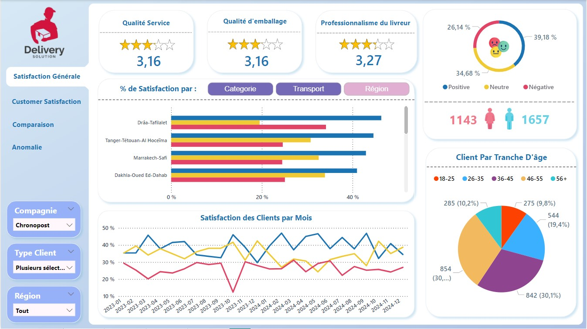
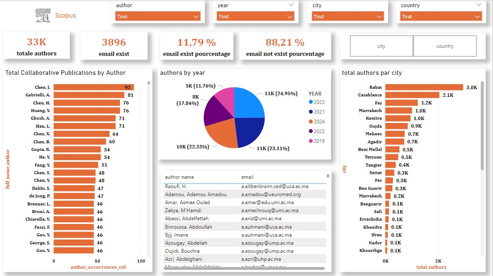

# 🌟 **Data Analytics Portfolio**

👋 Welcome to my **Data Analyst** portfolio! Here, I showcase my projects created with **Power BI**, where each dashboard tells a unique story through data. Whether you're a recruiter, a data enthusiast, or just curious, dive into my creations and discover how I leverage the power of **data visualization** to turn numbers into actionable insights. 🚀

---

## 📌 **About This Portfolio**

🔍 Each project in this portfolio explores a different domain, highlighting:  
- **Strategic Analyses**: Identifying trends, solving problems, and delivering actionable insights.  
- **Dynamic Visualizations**: Interactive charts, intuitive reports, and immersive storytelling.  
- **The Impact of Data**: Translating complex metrics into understandable narratives.  

🌐 **Direct Access**: Click on the links to explore each Power BI dashboard online.

---

## 🗂️ **Latest Projets**

# 📊 Customer Data Quality Analysis - Wafa Assurance  

## 🛠️ Project Description  
This project focuses on analyzing and improving the quality of customer data for **Wafa Assurance Maroc**, a leading insurance company. High-quality data is essential for optimizing processes and enabling strategic decision-making. The dashboard is tailored to meet the needs of both **Data Owners** and **Data Stewards**.  

## 📈 Dashboard Overview  
### 📍 Visualization:  

## ⚠️ Important Note  
The data displayed in this dashboard is **dummy data**, used to ensure the confidentiality of actual customer information.  

## 🏷️ Keywords  
- 🛡️ _Data Quality_  
- 📊 _Dynamic Dashboards_  
- 📜 _Historical Data_  
- 🔄 _Automation_  
- 📈 _KPIs_  
- 🌟 _Star Schema_  
- 👥 _Data Owner_  
- 👨‍💻 _Data Steward_  

## 🌐 How to Access  
You can view the live dashboard using the link below:  
👉 **[View the Dashboard](https://app.powerbi.com/view?r=eyJrIjoiZjI3ODA3M2YtYzNlYy00OTEzLWIwMjItMjgxZDk3MTQ4MDJmIiwidCI6ImMyNzg3OTIyLTExZDktNGNhOC1hYWRmLTVlZjdmZjMxYTEyNyJ9)**  

---  

# 📊 Delivery Reviews Analysis Dashboard  

## 🛠️ Project Description  
This project provides an in-depth analysis of customer reviews and delivery performance across various companies, including **Jumia**, **Glovo**, **Chronopost**, and **Tawssil**. The dashboard leverages data updated in real-time from Google Forms and imported via Google Sheets into Power BI. It aims to highlight key insights, facilitate comparisons, and improve the overall delivery experience.  

## 📈 Dashboard Overview  
### 📍 Visualization:  

### Key Features:  
- Comparative analysis of delivery times, customer satisfaction, and service ratings.  
- Dynamic visuals for tracking trends and identifying improvement opportunities.  
- Regular updates using integrated Google Sheets data pipelines.  

## 🏷️ Keywords  
- 📦 _Delivery Reviews_  
- 📊 _Comparative Analysis_  
- ⏱️ _Real-Time Updates_  
- 📈 _KPIs_  
- 🌐 _Google Sheets Integration_  
- 🌟 _Customer Satisfaction_  
- 🚚 _Delivery Performance_  

## 🌐 How to Access  
You can view the live dashboard using the link below:  
👉 **[View the Dashboard](https://app.powerbi.com/view?r=eyJrIjoiYTM1NzJhYzctOTMyYS00NDVlLWI2NDMtNjU5NzhhMDY1ZDY5IiwidCI6ImMyNzg3OTIyLTExZDktNGNhOC1hYWRmLTVlZjdmZjMxYTEyNyJ9)**  

---  

# 🎫 Ticket Tracking and Analysis Dashboard - Company X  

## 🛠️ Project Description  
The goal of this dashboard is to track and analyze the tickets created within **Company X**. The dashboard offers insights into ticket status (created, resolved, incident) across various analytical dimensions.  

## 📈 Dashboard Overview  
### 📍 Visualization:  
 

## 🏷️ Keywords  
- 🎫 _Ticket Tracking_  
- 📊 _Ticket Analysis_  
- 🧑‍💻 _Employee Performance_  
- 🔄 _Time-based Analysis_  
- 👥 _Team Evolution_  
- 📈 _KPIs_  

## 🌐 How to Access  
You can view the live dashboard using the link below:  
👉 **[View the Dashboard](https://app.powerbi.com/view?r=eyJrIjoiNTAxNTc4YTItYWZiOC00NDdhLWFhZjUtNGEzMmMwY2Y3NDRlIiwidCI6ImMyNzg3OTIyLTExZDktNGNhOC1hYWRmLTVlZjdmZjMxYTEyNyJ9)** 

---

# 📊 Sales Orders and Invoices Analysis Dashboard  

## 🛠️ Project Description  
This dashboard is dedicated to the analysis of **sales orders** and **invoices**, offering insights from different perspectives. It also includes a **comparative analytics** section, allowing for a detailed comparison of performance across multiple dimensions.  

## 📈 Dashboard Overview  
### 📍 Visualization:  

## 🏷️ Keywords  
- 📦 _Sales Orders_  
- 💵 _Invoices_  
- 📊 _Comparative Analytics_  
- 🔄 _Multidimensional Analysis_  
- 📈 _Performance Analysis_  
- 📅 _Time-based Comparison_  

## 🌐 How to Access  
You can view the live dashboard using the link below:  
👉 **[View the Dashboard](https://app.powerbi.com/view?r=eyJrIjoiNjdiOTI2YmYtZTFjOS00ZTIxLWFmZGYtZDNhNmFkZjk5NTk2IiwidCI6ImMyNzg3OTIyLTExZDktNGNhOC1hYWRmLTVlZjdmZjMxYTEyNyJ9)**  

---

# 📊 Multi-Dimensional Data Analysis Dashboard - Scopus Data  

## 🛠️ Project Description  
This project is focused on analyzing and visualizing research data sourced from **Scopus** using a multi-dimensional approach. The dashboard is designed to provide comprehensive insights into various aspects of research, such as **authors**, **publications**, **affiliations**, **geographical distribution**, **web presence**, and **conference participation**. The data is processed and imported from an **SQL Server** database to ensure efficient data handling and scalability.  

## 📈 Dashboard Overview  
### 📍 Visualization:  
 

## 🏷️ Keywords  
- 📝 _Author Analysis_  
- 📚 _Publication Trends_  
- 🌍 _Geographical Distribution_  
- 🏛️ _Affiliation Insights_  
- 📊 _Dynamic Dashboards_  
- 🖥️ _Web Presence_  
- 🎓 _Conference Participation_  
- 💾 _SQL Server Integration_
- 🌟 _Star Schema_  

## 🌐 How to Access  
You can view the live dashboard using the link below:  
👉 **[View the Dashboard](https://app.powerbi.com/view?r=eyJrIjoiMTQwYTFmOTktZTQwMS00ZjQxLWFmNmEtMzNhNGQ2ZDA4YTkxIiwidCI6ImMyNzg3OTIyLTExZDktNGNhOC1hYWRmLTVlZjdmZjMxYTEyNyJ9)**  

---  

# 🌍 Gitex Africa 2024 Data Analysis Dashboard  

## 🛠️ Project Description  
This dashboard is dedicated to analyzing data from **Gitex Africa 2024**, offering two distinct perspectives:  
1. A global overview focusing on event details and visitor insights.  
2. A detailed view dedicated to the **speakers**, showcasing their information and contributions.  

## 📈 Dashboard Overview  
### 📍 Visualization:  

## 🏷️ Keywords  
- 🌍 _Event Analytics_  
- 👥 _Visitor Insights_  
- 🎤 _Speaker Information_  
- 📊 _Dynamic Dashboards_  
- 🔄 _Automation_  
- 📈 _Key Metrics_  

## 🌐 How to Access  
You can view the live dashboard using the link below:  
👉 **[View the Dashboard](https://app.powerbi.com/view?r=eyJrIjoiMTJjYmE4NjYtOTQ0Ny00YjRiLWE4OTQtODM4MmY4ZDVkYTdjIiwidCI6ImMyNzg3OTIyLTExZDktNGNhOC1hYWRmLTVlZjdmZjMxYTEyNyJ9)**  

---

## 🚀 **Why Me?**

✨ As a **passionate Data Analyst**, I am driven by a mission: turning data into actionable solutions.  
- **Technical Skills**: Power BI, Power Query, DAX, SQL, Python, Data Storytelling, ETL, ELT.  
- **Strategic Vision**: Designing dashboards that add value and support data-driven decision-making.  
- **Creativity**: Elegant designs, impactful insights, and engaging reports.

---

## 🌟 **Other Projects**  
Below are links to additional dashboards I've worked on:  
- **[Controlling Dashboard](https://app.powerbi.com/reportEmbed?reportId=2a79de5e-453e-457f-b7c7-bcb4f2ddee19&autoAuth=true&ctid=04d6a2f0-64b2-4e71-b348-646401d08ee8)**   
---

💡 _"Les données racontent des histoires, et je suis ici pour les écrire."_ ✨
